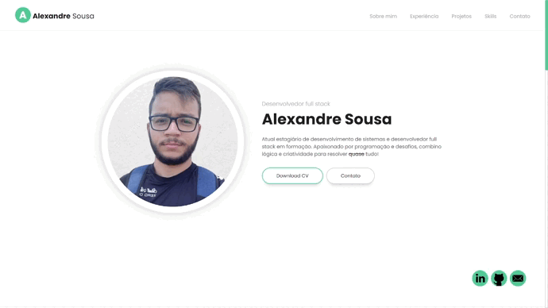

<h1 align="center"> Portfolio/Personal Page - Alexandre Silva</h1>

<strong>Link do projeto:</strong> https://alexandresouva.github.io/personal-page/

## :loudspeaker: Descrição do projeto

Consiste na criação de um site no estilo de portfólio pessoal (personal page). A ferramenta Figma foi sugerida para elaboração do layout, contudo, também foi aberta a possibilidade de utilizar sites como modelo. 

Optei pela segunda opção pois encontrei um modelo em que poderia trabalhar todos os conceitos vistos em aula e ainda incrementar coisas novas. Você pode acessar site de referência <a href="https://lmpixels.com/wp/leven-wp/full-width/">clicando aqui</a>.

### :blue_book: Stacks e conhecimentos utilizados

**HTML**
- Uso de tags semânticas, como *header, nav, main, footer*, entre outras.
- Indentação e boas práticas.

**CSS**
- Box model para recriação do layout proposto.
- Posicionamento de itens com flexbox.
- Importação de fontes e transições com hover e webkit.

**Javascript**
- Uso simples de uma função no texto final de copyright. Neste caso, sempre retornará o ano atual seguido da palavra "copyright".
- Aviso "alert" indicando o preenchimento do formulário de contato. 

___

### :link: Revisões futuras

Esta foi apenas a primeira versão do projeto, para ser entregue e apresentado em sala de aula. Futuramente, alguns pontos serão corrigidos e implantados neste projeto, tais como:

- **Responsividade**: Este projeto ainda não está responsivo. Apesar de muitos elementos estarem com unidades relativas e se adaptarem bem à tela, o estudo de responsividade e media query ainda não foi realizado. 
- **Formulário funcional**: No momento, é possível apenas escrever no formulário e simular o envio. A idéia é utilizar formas para fazer a validação deste preenchimento e alocar em um banco de dados.
- **Maior uso do Javascript**: A intenção era utilizar apenas HTML e CSS neste projeto. Note, portanto, que o uso de Javascript foi quase nulo.
- **Correção do código**: Como citado, este foi o meu primeiro projeto e com certeza cometi erros dos quais não consigo perceber agora. Espero que em uma eventual atualização deste projeto, posso identificar e aplicar melhorias no código atual. 

> _“Não são nossas habilidades que mostram quem realmente somos, são as nossas escolhas.” 
 Alvo Dumbledore_ 
